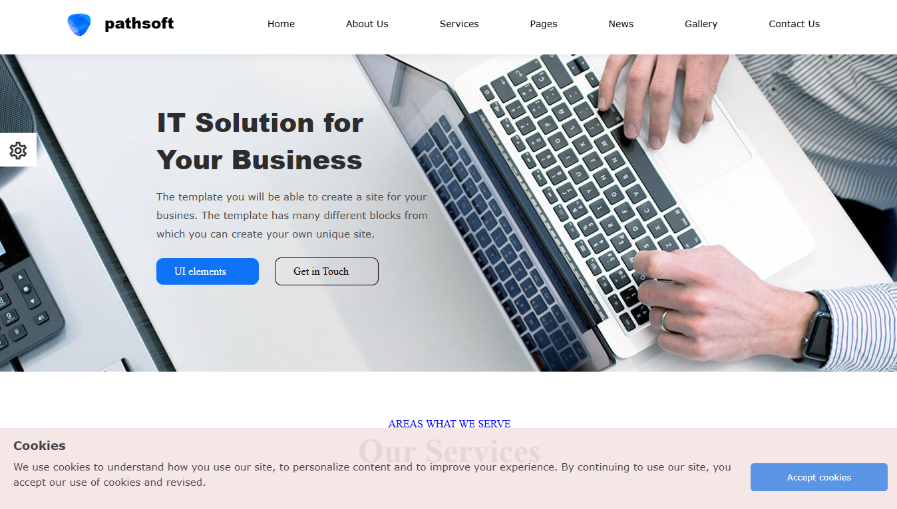
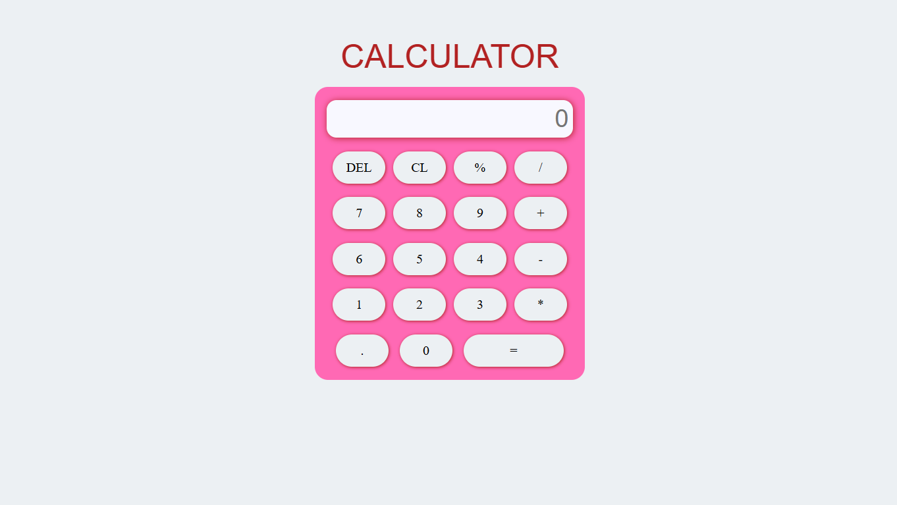

# Frontend Practice Projects

This repository contains multiple frontend projects built using **HTML, CSS, and basic JavaScript**.  
Each project focuses on layout design, styling, and basic interactivity.

The goal of this repository is to showcase hands-on practice with core frontend concepts such as page structure, responsive layouts, and simple user interactions.

## Live Demo
https://karthick-vm.github.io/frontend-practice-projects/

---

# Projects Included

### 1. IT Solution Website

- Static multi-section website
- Focus on layout design and styling
- Technologies: HTML, CSS

### 2. Job Website

- Job listing style website UI
- Multiple sections and reusable components
- Technologies: HTML, CSS

### 3. Calculator

- Functional calculator interface
- Basic arithmetic operations
- Technologies: HTML, CSS, JavaScript

---

## Technologies Used
- HTML5
- CSS3
- JavaScript (basic)

---

Notes
- These projects are focused on frontend fundamentals.
- No frameworks or libraries are used.
- Designed to demonstrate understanding of structure, styling, and basic scripting.
